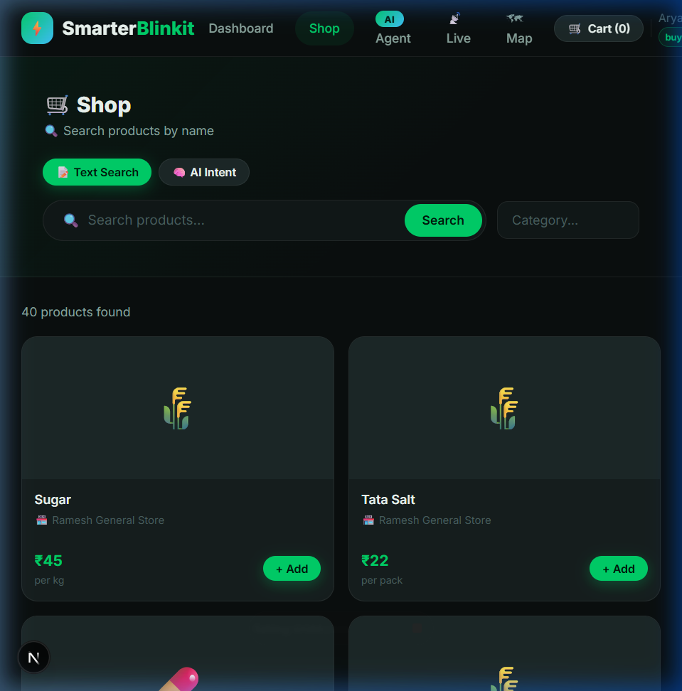
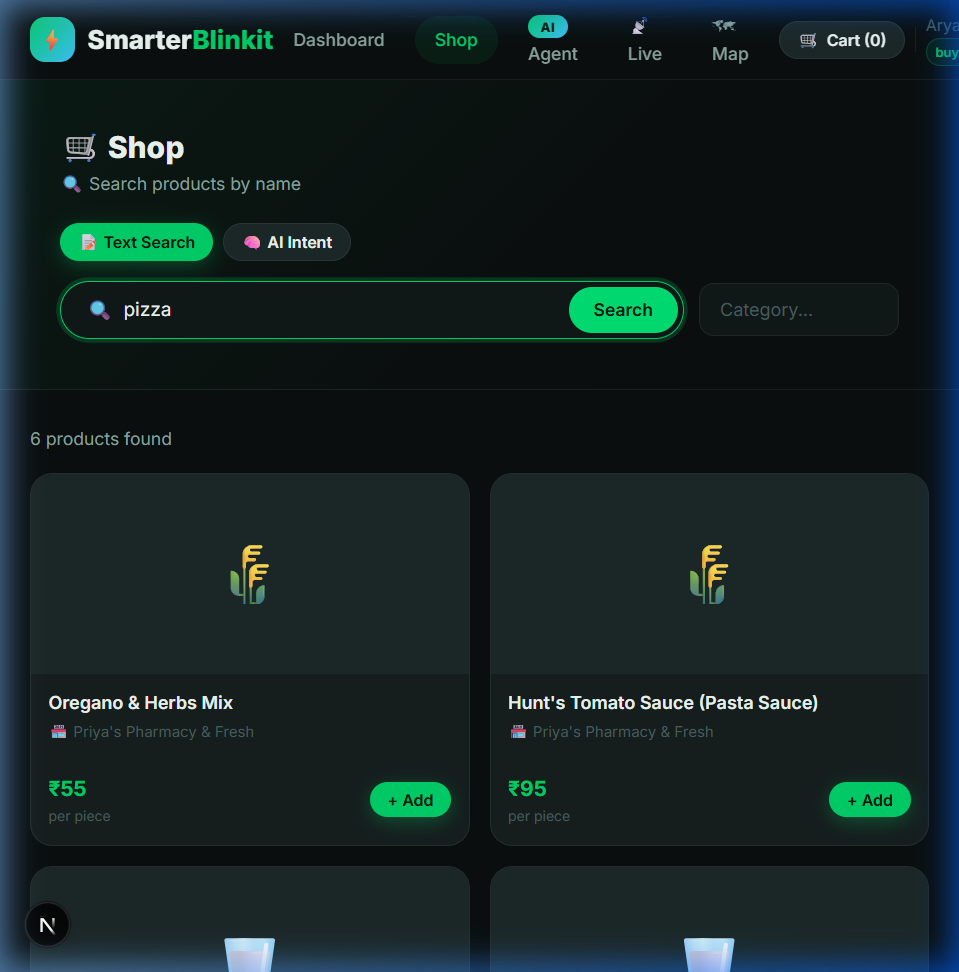
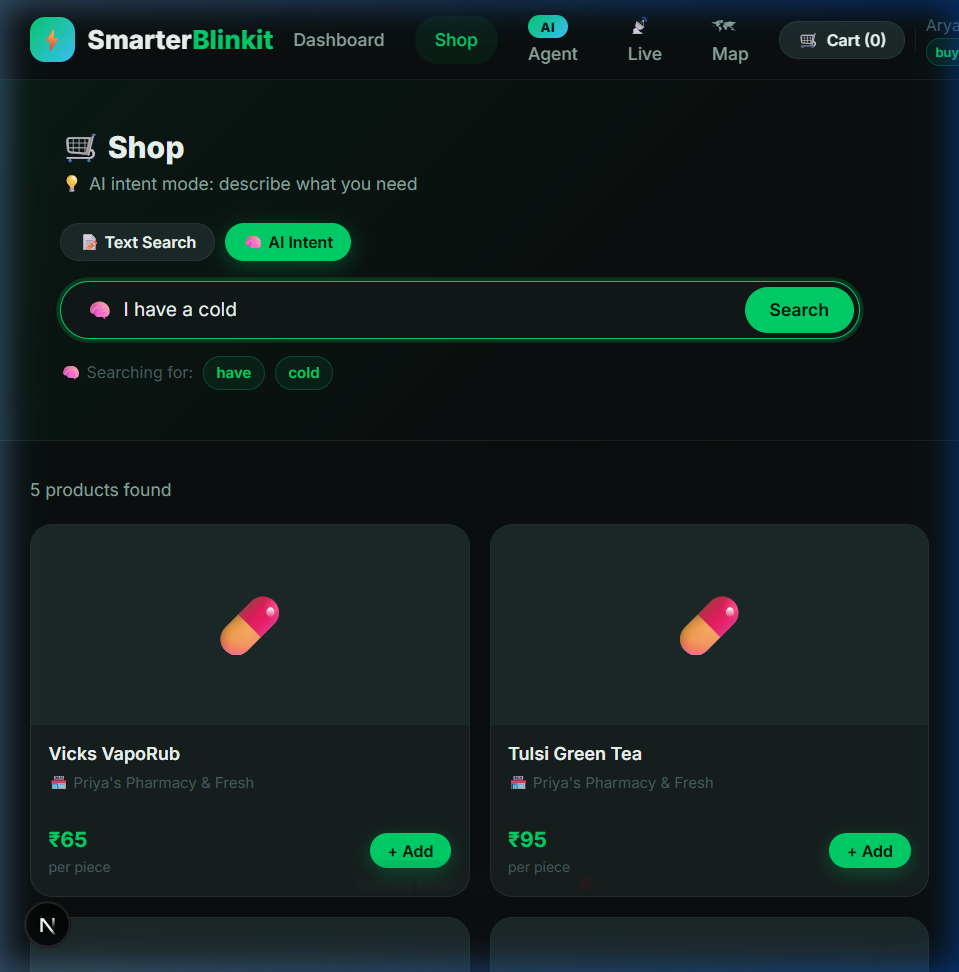
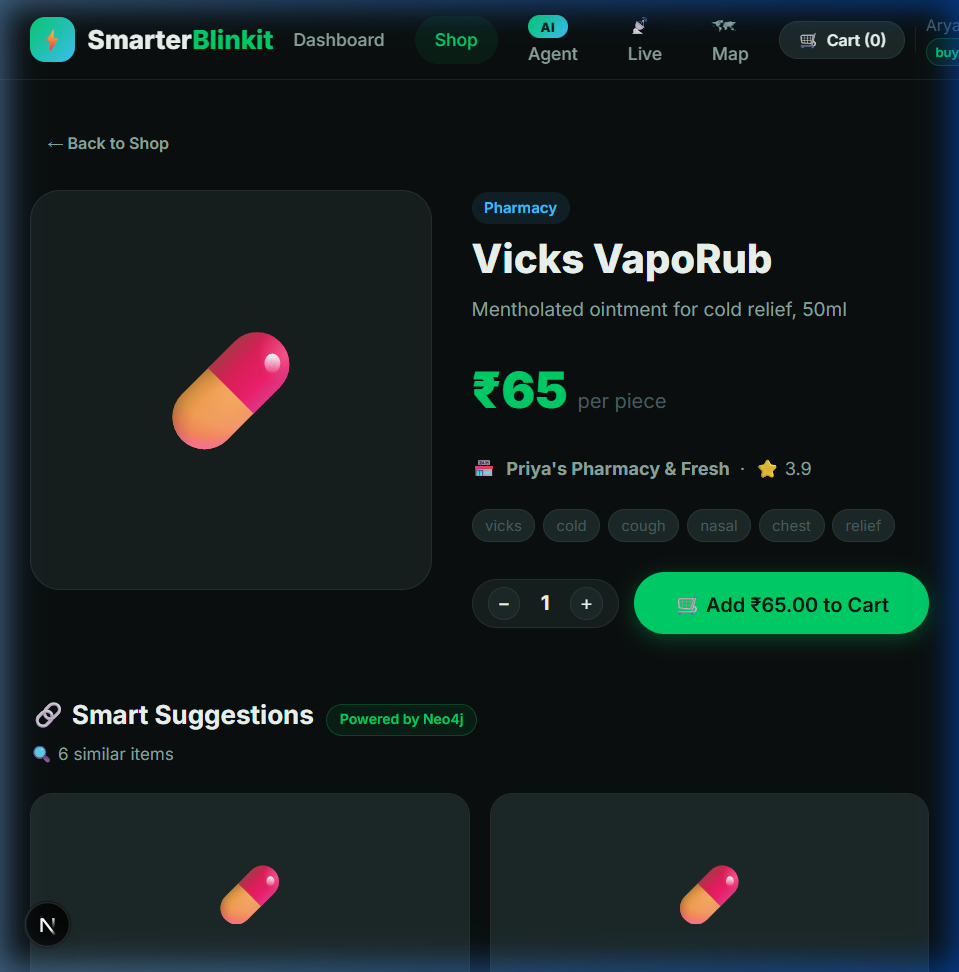
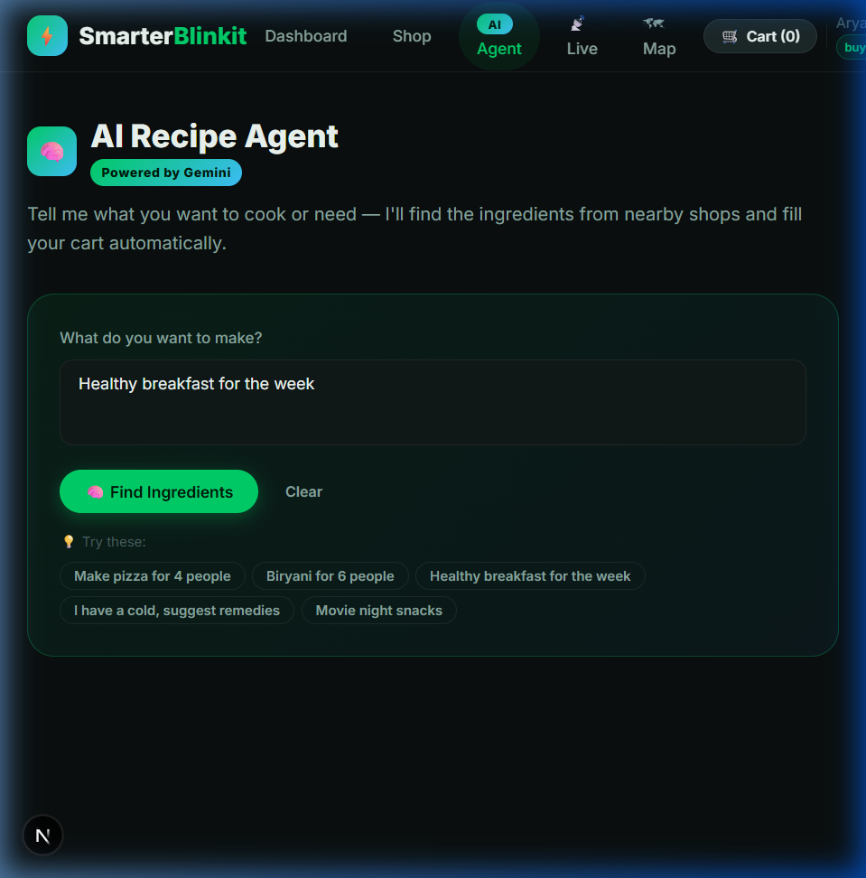
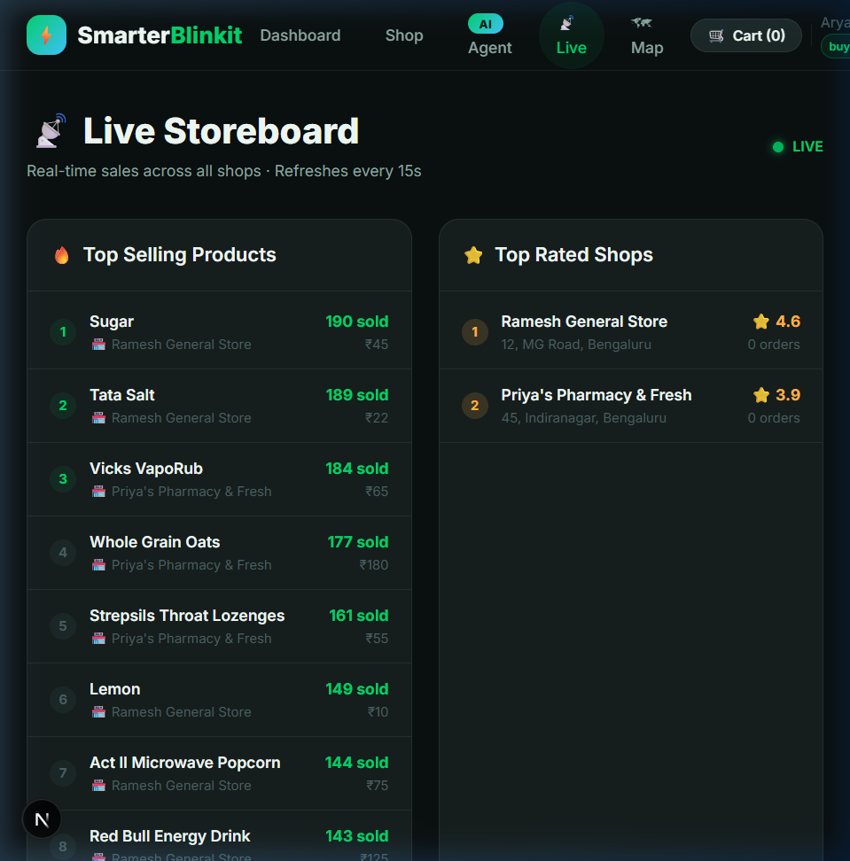
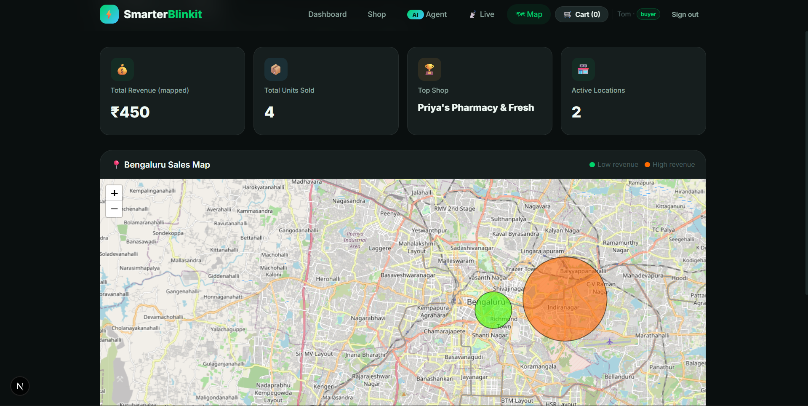
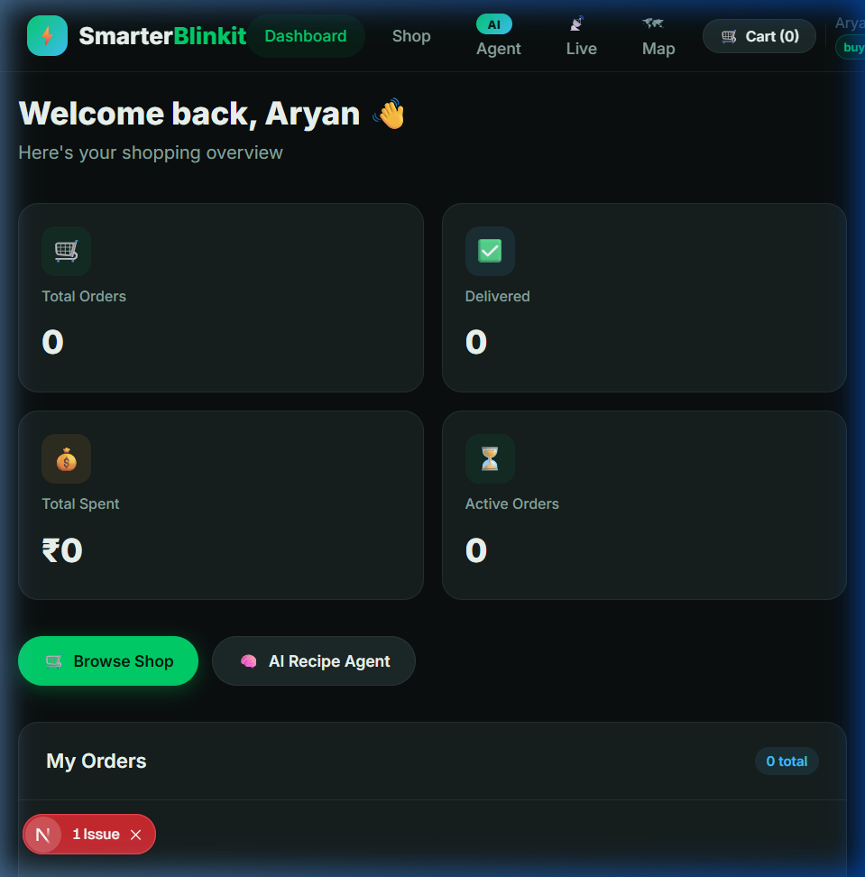

# Smarter BlinkIt 🛒⚡

> An AI-powered marketplace connecting buyers and local sellers. Instead of item-by-item searching, simply describe what you need — the AI fills your cart automatically.

**Status: 🟢 Features Working**

* Dual Login
* Face ID Login
* Role-based Routing
* Theme Consistency
* Progressive Smart Search
* AI Recipe Agent
* Neo4j Graph Suggestions
* Intent-Aware Search
*   **Local First & Manual Geocoding**: Detects location or geocodes manual addresses for split-delivery logic.
*   **3-Tier Smart Selection**: AI Recommendations with a robust MongoDB fallback (Graph -> AI -> Category).
*   **Multi-City Marketplace**: Pre-seeded shops and buyers across Bengaluru, Mumbai, and New Delhi.
*   **Dynamic AI Vectors**: Automated Gemini embedding backfill for new and existing products.
*   **Bulletproof AI Fallbacks**: 100% uptime architecture using Hugging Face `Qwen2.5-72B` and local Node.js `Cosine Similarity` when APIs/Databases fail.

**NOTE:** The platform is fully functional with all 4 stages (Foundation, Automator, Orchestrator, God Mode) complete, however some features need refinement according to the project demands and responsiveness.
---

## 📸 Screenshots

| Shop — Product Grid | Text Search ("pizza") |
|---|---|
|  |  |

| 🧠 AI Intent Search ("I have a cold") | Product Detail + Neo4j Suggestions |
|---|---|
|  |  |

| 🤖 AI Recipe Agent | 📡 Live Storeboard |
|---|---|
|  |  |

| 🗺️ Money Map (Leaflet.js) | Buyer Dashboard |
|---|---|
|  |  |

---

## 🎯 Project Overview

Smarter BlinkIt is a full-stack web application built around the concept of an **AI Shopping Assistant** and a **Barcode-based Inventory System** for sellers.

### Tech Stack

| Layer | Technology |
|---|---|
| **Frontend** | Next.js 14 (App Router) + Vanilla CSS |
| **Backend** | Node.js + Express REST API |
| **Primary DB** | MongoDB Atlas (users, products, orders, shops, fallback vector models) |
| **Graph DB** | Neo4j AuraDB (product relationships: SIMILAR_TO, BOUGHT_WITH, vector index) |
| **Primary NLP (AI)** | Google Gemini `gemini-2.5-flash` (recipe agent) & `gemini-2.0-flash` (intent parsing) |
| **Primary Vector AI** | Google Gemini `gemini-embedding-001` (3072-dimensional) |
| **Fallback NLP (AI)** | Hugging Face Inference API `Qwen/Qwen2.5-72B-Instruct` |
| **Fallback Math Engine**| Node.js custom `Cosine Similarity` vector calculation algorithm |
| **Face Recognition** | face-api.js (browser-side, TensorFlow.js models) |
| **Barcode Scanning** | `@zxing/browser` (ZXing — cross-platform) |
| **Payments** | Stripe API (Test Mode) + Cash on Delivery |
| **Real-time** | Socket.io (live storeboard events) |
| **Maps** | Leaflet.js + Leaflet.heat |

---

## 📡 External APIs & Services

We leverage a suite of modern APIs to power the "Smarter" features:

1.  **Google Gemini AI (`gemini-2.0-flash`)**: Orchestrates the Recipe Agent, Intent Search, and Natural Language processing.
2.  **Google Gemini Embeddings (`gemini-embedding-001`)**: Generates 3072-dimensional vector representations for high-precision semantic product pairing.
3.  **Nominatim (OpenStreetMap)**: Provides forward and reverse geocoding for detecting user locations and converting typed addresses to coordinates.
4.  **OSRM (Open Source Routing Machine)**: Solves the Vehicle Routing Problem (VRP) to calculate optimized multi-stop delivery routes between shops and the buyer.
5.  **Indian Postal Pin Code API (`api.postalpincode.in`)**: Automatically maps 6-digit PIN codes to their respective Districts/Cities and States during registration.
6.  **Hugging Face (Inference Fallback)**: Used as a secondary layer for semantic similarity if Gemini quotas are exceeded.
7.  **Stripe API (Test Mode)**: Handles real card payments via Stripe PaymentIntents. Uses `@stripe/stripe-js` (frontend) and `stripe` Node SDK (backend) for a full PCI-compliant checkout flow.


---

## 🚀 How It Works

### Stage 1 — The Foundation ✅
- **Dual Login**: Buyers and Sellers see completely different dashboards after login.
- **Role-based Routing**: Seamless redirection post-login preventing back-button loops.
- **Face ID Login**: Register your face once, then log in just by looking at the camera (face-api.js), now integrated directly into the signup flow.
- **Theme Consistency**: Fully reactive Light/Dark CSS Variable Theme architecture across the app.
- **Progressive Smart Search**: Google-like live search — results update as you type. Typing `V` instantly returns Vicks, Vitamins, Vegetables etc. No need to type the full keyword.

### Stage 2 — The Automator ✅
- **AI Recipe Agent**: Type "Make pizza for 4 people" → Gemini extracts ingredients → matches nearest shop products → one-click cart fill.
- **Neo4j Graph Suggestions**: Products stored as graph nodes. When you buy pasta, the system records `BOUGHT_WITH` cheese → next user sees suggestion.
- **Intent-Aware Search**: Search "I have a cold" → AI returns Honey, Ginger Tea, Vitamin C.
- **AI Redundancy**: Complete fallback protocols for both Intent and Recipe agents, bypassing Gemini rate limit errors invisibly.

### Stage 3 — Orchestrator ✅
- **Stripe Payment Integration**: Real card payments via Stripe test mode with inline Card Element. Supports COD fallback. Order summary shows subtotal, delivery fee (free above ₹500), and grand total.
- **Location Auto-Detect**: Integrates Nominatim Reverse Geocoding enabling auto-detecting user checkout delivery address.
- **Live Storeboard**: Real-time Socket.io dashboard showing top-selling products and top-rated shops.
- **Smart Cart Splitting**: Multi-shop orders auto-split per shop.
- **Product Detail Page**: Full product info with quantity selector and Neo4j-powered Smart Suggestions.
- **Live Dynamic Filters**: Categories and Shops are fetched live from the database. Any new shop or category added by a seller is instantly reflected for all buyers.
- **Smart Shop Filter**: Selecting a specific shop overrides the "Nearby Only" proximity constraint, showing all products from that shop regardless of distance.
- **Smart Category Combobox**: Seller's category input features a searchable dropdown with live filtering and inline "+ Add new category" option.

### Bonus / God Mode ✅
- **Money Map**: Leaflet.js heatmap showing order density and intensity based on live MongoDB transactions.
- **Smart Product Pairing**: Hybrid engine using **Google Gemini** embeddings (3072-dim). It features a 3-tier fallback (Neo4j Graph -> Semantic Vector -> MongoDB Category) to ensure 100% availability with conceptual pairing.
- **Local First Geocoding**: Manual address fields on registration are automatically converted to coordinates via Nominatim fallback if GPS is not used.
- **Advanced Inventory**: ZXing-powered barcode scanner for sellers to manage 1:1 inventory mapping.
- **Secure Developer Admin**: Secure Admin Panel (`/admin/users`) for full site surveillance.

### Stage 5 — Reliability & Fallbacks ✅
- **Instant Neo4j Fail-Fast**: Custom driver configurations detect sleeping AuraDB instances in 3 seconds to prevent API timeouts.
- **In-Memory Semantic Search**: If Neo4j is offline, vectors are queried from MongoDB and processed locally via an optimized Cosine Similarity Node.js function, ensuring 100% smart-pairing uptime without degrading into basic keyword search.
- **Hugging Face Inference**: Completely bypasses Gemini API rate limits (HTTP 429) by delegating NLP keyword extraction and intent parsing to Hugging Face's `Qwen2.5-72B-Instruct` model on the fly.

---

## 🧠 AI Architecture & Fallbacks

The Smarter-Blinkit platform utilizes a multi-layered AI architecture to guarantee intelligent search results even when primary third-party services (Google, Neo4j) are disconnected, rate-limited, or asleep.

### 1. AI Intent Search (The Smart Search Bar)
*   **Goal:** Translates abstract user needs ("I have a cold", "movie night") into hyper-relevant product recommendations.
*   **Step 1: Concept Expansion (NLP)**
    *   **Primary:** Google Gemini (`gemini-2.0-flash`) expands the query into 5-6 grocery keywords (e.g., `["honey", "ginger tea", "cough syrup"]`).
    *   **Fallback:** Hugging Face Inference API (`Qwen/Qwen2.5-72B-Instruct`) takes over instantly if Gemini is unreachable or rate-limited.
*   **Step 2: Semantic Vector Match (Math)**
    *   **Primary:** Google Gemini (`gemini-embedding-001`) converts the query into a 3072-dimensional math vector. **Neo4j Graph Database** performs a lightning-fast nearest-neighbor Cosine Similarity search on its vector index to find conceptually related products.
    *   **Fallback (The "Fail-Fast" Engine):** If the Neo4j Aura free instance is paused, the connection intentionally fails within 3000ms. Node.js then fetches all 3072D embeddings directly from **MongoDB** and computes the Cosine Similarity locally in memory.
*   **Step 3: Keyword Fallback (Fail-Safe)**
    *   If embedding generation fails entirely (e.g., both Gemini and Hugging Face are blocked by a firewall), the system skips vector math and defaults to executing a highly optimized MongoDB Regex search using the expanded keywords from Step 1.

### 2. AI Recipe Agent
*   **Goal:** Converts recipe requests ("Make a pizza for 4 people") into a structured, ready-to-buy cart list.
*   **Step 1: JSON Ingredient Extraction**
    *   **Primary:** Google Gemini (`gemini-2.5-flash`) extracts ingredients, exact quantities, and optimized search parameters into a strict JSON array.
    *   **Fallback:** Hugging Face Inference API (`Qwen/Qwen2.5-72B-Instruct`) is invoked to extract the identical JSON structure if Gemini throws a 429 quota error.
*   **Step 2: Exact Product Matching**
    *   Unlike Intent Search (which looks for *concepts*), the Recipe Agent requires *exact* ingredients. It runs a direct **MongoDB Keyword Search** to find specific items like "Flour" or "Salt".
    *   If an exact match isn't found, it gently falls back to the local **Node.js Cosine Similarity** engine to find the closest available alternative in stock.

---

## 🛠 Quick Start

### Prerequisites
- Node.js 18+
- MongoDB Atlas account
- Neo4j AuraDB account
- Google Gemini API key
- Hugging Face Access Token (`HF_TOKEN` for AI failover)

### 1. Clone & Setup Backend
```bash
git clone https://github.com/Saarvik-got-it/smarter-blinkit.git
cd smarter-blinkit/backend
npm install
# Fill in .env (see .env.example)
npm run dev
```

### 2. Seed the Database
```bash
cd backend
node seed.js
```
This creates **126 products** across 4 shops in 3 major cities, providing a ready-to-test multi-city marketplace environment.

| Account | Email | Location |
|---|---|---|
| 🛒 BLR Buyer | `aryan@buyer.com` | Bengaluru |
| 🛒 BOM Buyer | `maya@buyer.com` | Mumbai |
| 🛒 DEL Buyer | `rohan@buyer.com` | New Delhi |
| 🏪 Seller 1 | `ramesh@shop.com` | Ramesh General Store (BLR) |
| 🏪 Seller 4 | `neha@shop.com` | Neha Organics (BOM) |
| 📦 Password | `password123` | (Common for all) |

### 3. Setup Frontend
```bash
cd ../frontend
npm install
# Fill in .env.local with: NEXT_PUBLIC_API_URL=http://localhost:5000/api
npm run dev
```

### 4. Open App
Visit `http://localhost:3000`

---

## 📁 Project Structure
```
smarter-blinkit/
├── frontend/                    # Next.js 14 app
│   ├── app/
│   │   ├── page.tsx            # Landing page
│   │   ├── login/              # Login (+ Face ID)
│   │   ├── register/           # Buyer / Seller registration
│   │   ├── dashboard/          # Role-based dashboard
│   │   ├── shop/               # Shop + intent search
│   │   │   └── [id]/           # Product detail + Neo4j suggestions
│   │   ├── ai-agent/           # AI Recipe Agent (Gemini)
│   │   ├── storeboard/         # Live Socket.io dashboard
│   │   └── money-map/          # Leaflet.js revenue heatmap
│   ├── components/
│   │   ├── Navbar.tsx
│   │   ├── CartSidebar.tsx     # Cart with mock checkout & location
│   │   ├── FaceLogin.tsx       # face-api.js face recognition login
│   │   ├── FaceRegister.tsx    # face-api.js enrollment
│   │   ├── BuyerDashboard.tsx
│   │   └── SellerDashboard.tsx # Inventory + native BarcodeDetector scanner tab
│   └── lib/context.tsx         # Global state (auth, cart, toasts)
│
├── backend/                     # Express API
│   ├── server.js               # Entry point (MongoDB + Socket.io)
│   ├── seed.js                 # Mock data seeder (42 products, 2 shops)
│   ├── models/                 # User, Product, Shop, Order
│   ├── routes/                 # auth, products, orders, shops, payments, ai, admin
│   ├── middleware/auth.js      # JWT + role guard
│   ├── services/
│   │   ├── neo4j.js           # Graph DB service (BOUGHT_WITH, SIMILAR_TO)
│   │   └── cartSplitter.js    # Multi-shop cart splitting
│   └── sockets/storeboard.js  # Real-time Socket.io events
│
├── .env.example                # Required environment variables
└── README.md
```

---

## 🔑 Environment Variables

Create `backend/.env` with:
```env
MONGODB_URI=mongodb+srv://...
GEMINI_API_KEY=AIza...
NEO4J_URI=neo4j+s://...
NEO4J_USERNAME=...
NEO4J_PASSWORD=...
NEO4J_DATABASE=...
JWT_SECRET=your_secret
PORT=5000
PAYMENT_MODE=stripe
STRIPE_SECRET_KEY=sk_test_...
STRIPE_PUBLISHABLE_KEY=pk_test_...
```

Create `frontend/.env.local` with:
```env
NEXT_PUBLIC_API_URL=http://localhost:5000/api
NEXT_PUBLIC_SOCKET_URL=http://localhost:5000
NEXT_PUBLIC_STRIPE_PUBLISHABLE_KEY=pk_test_...
```

---

## 📊 Progress Tracker

| Stage | Feature | Status |
|---|---|---|
| 1 | Buyer/Seller Auth (JWT) | ✅ Done |
| 1 | Face ID Login & Registration | ✅ Done |
| 1 | Intent-based Semantic Search | ✅ Done |
| 1 | Native BarcodeDetector Inventory Scanner | ✅ Done |
| 1 | Location Checkout & Mock Payments | ✅ Done |
| 1 | Global Light/Dark Theme & Filters | ✅ Done |
| 1 | Secure Admin User Dashboard | ✅ Done |
| 2 | AI Recipe Agent (Gemini 2.0 Flash) | ✅ Done |
| 2 | Neo4j Graph: BOUGHT_WITH | ✅ Done |
| 2 | Neo4j Graph: SIMILAR_TO | ✅ Done |
| 3 | Smart Cart Splitting | ✅ Done |
| 3 | Live Storeboard (Socket.io) | ✅ Done |
| 3 | Product Detail + Neo4j Suggestions | ✅ Done |
| 3 | Stripe Payment Integration (Test Mode) | ✅ Done |
| 3 | Smart Shop Filter Override | ✅ Done |
| 3 | Smart Category Combobox | ✅ Done |
| Bonus | Money Map (Leaflet.js + OSM) | ✅ Done |
| Bonus | Smart Product Pairing (Hugging Face + Neo4j) | ✅ Done |
| Bonus | AI Intent Rate-limit Fallback | ✅ Done |

---

## 🔗 API Endpoints

| Method | Endpoint | Description |
|---|---|---|
| POST | `/api/auth/register` | Register buyer/seller |
| POST | `/api/auth/login` | JWT login |
| POST | `/api/auth/face-login` | Face descriptor match |
| GET | `/api/products/search?q=&lat=&lng=` | Intent + geo search |
| GET | `/api/products/:id/suggestions` | Neo4j similar products |
| POST | `/api/products/barcode/lookup` | Barcode → product |
| POST | `/api/orders` | Place order (with cart splitting) |
| POST | `/api/payments/create-intent` | Create Stripe PaymentIntent (or mock fallback) |
| POST | `/api/payments/verify` | Verify Stripe PaymentIntent status |
| POST | `/api/ai/recipe-agent` | Gemini recipe → cart items |
| POST | `/api/ai/intent-search` | Semantic query expansion |
| GET | `/api/shops/nearby?lat=&lng=` | Geo-sorted shops |
| GET | `/api/shops/storeboard` | Live top sellers |
| GET | `/api/shops/money-map` | Heatmap data |
| DELETE | `/api/auth/delete-account` | Delete current user account (+ shop if seller) |
| GET | `/api/auth/me` | Get current logged-in user |
| POST | `/api/auth/face-register` | Save face descriptor for current user |
| GET | `/api/shops/my` | Get seller's own shop |
| POST | `/api/shops` | Create a shop (for sellers without one) |
| PUT | `/api/shops/my` | Update seller's shop details |

---

*Last updated: Stripe Integration + Smart Filters — March 2026*
